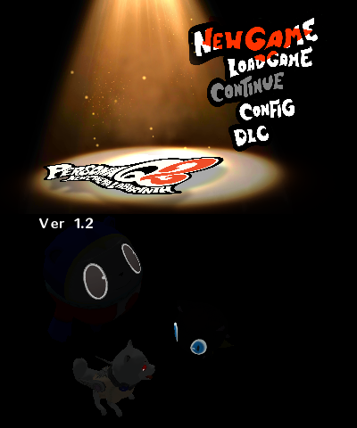
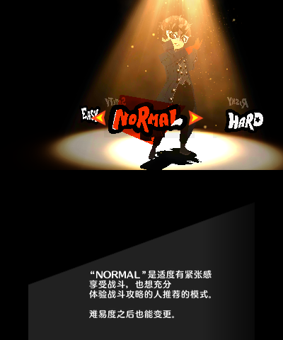
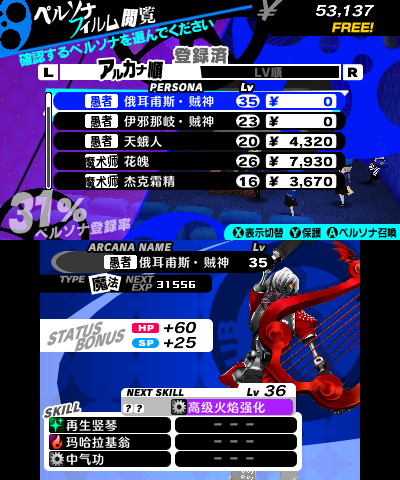

# 《女神异闻录Q2 新电影迷宫》汉化

## 基本说明
**注意：本补丁仅用作技术交流，请用于正版游戏。**

本项目是对《女神异闻录Q2 新电影迷宫》（<span lang="ja">ペルソナQ2 ニュー シネマ ラビリンス</span>）的简体中文本地化，尚未完成。

## 使用方式
请自行获取日文版游戏，然后下载汉化补丁并安装 `.cia` 文件。本补丁已经包含了原版游戏的 1.2 版本升级补丁，无需额外安装升级补丁。

## 兼容性
本汉化补丁支持 3DS 主机上运行的卡带版和下载版游戏，也支持 Citra 及基于 Citra 的模拟器。

对于已在日文版本创建的存档，由于本汉化补丁在字库方面做了特殊处理，对于大部分常用的日文汉字来说并不会导致玩家给 4 位主角起的名字乱码，并且会以对应的简体字显示。但由于字库容量有限，一些不常用的日文汉字被替换为了没有对应关系的简体字。对于新创建的存档，可以通过日语假名来输入名字，例如：

- 结城 理：ゆうき まこと
- 汐见 琴音：しおみ ことね
- 鸣上 悠：なるかみ ゆう
- 雨宫 莲：あまみや れん

## 构建方式
本项目采用 GitHub Actions 自动构建 Luma 重定向补丁。也可以手动构建，前提条件：

- [Python 3.10+](https://www.python.org/downloads/)（`pip install -r requirements.txt`）
- [PowerShell 5.0+](https://learn.microsoft.com/powershell/)
- [.NET 8.0 SDK](https://dotnet.microsoft.com/download/dotnet/8.0)
- 字体文件（默认读取以下文件：`files/fonts/FZFWQingYinTiJWB.ttf`，推荐使用 [方正FW轻吟体B](https://www.foundertype.com/index.php/FontInfo/index/id/4985) 作为字体，请自行获取授权）

在 PowerShell 中运行：

``` powershell
. scripts\build_patch.ps1
```

构建完成后，Luma 重定向补丁将保存在 `out/` 文件夹下。然后可以手动构建 `.cia` 文件。

## 截图预览
  
  


## 致谢
- [3dstool](https://github.com/dnasdw/3dstool)，作者：[Sun Daowen](https://github.com/dnasdw)
- [3dstools](https://github.com/ObsidianX/3dstools)，作者：[ObsidianX](https://github.com/ObsidianX)
- [Atlus-Script-Tools](https://github.com/tge-was-taken/Atlus-Script-Tools)，作者：[tge-was-taken](https://github.com/tge-was-taken)
- [PersonaEditor](https://github.com/Meloman19/PersonaEditor)，作者：[Meloman19](https://github.com/Meloman19)
- [Persona-Modding](https://github.com/lraty-li/Persona-Modding)，作者：[lraty-li](https://https://github.com/lraty-li)
- [Project_CTR](https://github.com/3DSGuy/Project_CTR)，作者：[3DSGuy](https://github.com/3DSGuy)
- [CRI File System Tools](https://www.welovepes.com/2020/10/crifilesystemtools.html)
